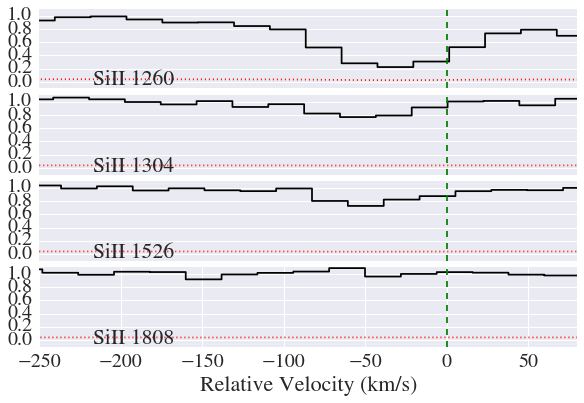
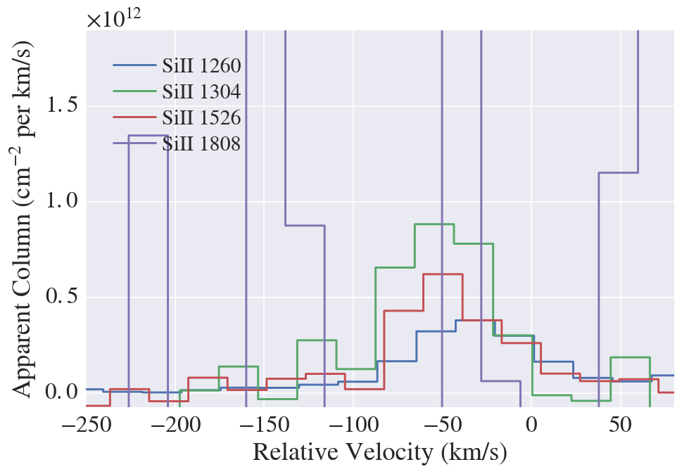
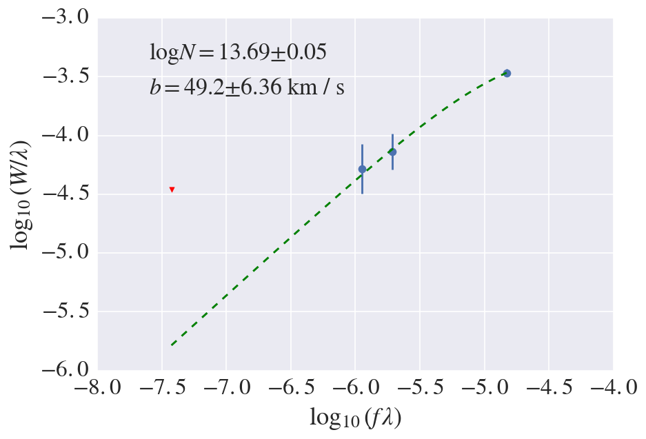

Column Densities with AbsComponent
==================================

.. code:: python

    %matplotlib inline

.. code:: python

    # imports
    try:
        import seaborn as sns; sns.set(context="notebook",font_scale=2)
    except:
        pass
    
    from scipy import integrate
    
    from linetools.isgm import abscomponent as lt_abscomp
    from linetools.spectralline import AbsLine
    from linetools.spectra import io as lsio
    #
    import imp
    lt_path = imp.find_module('linetools')[1]

.. parsed-literal::

    /Users/xavier/anaconda/lib/python2.7/site-packages/matplotlib/__init__.py:872: UserWarning: axes.color_cycle is deprecated and replaced with axes.prop_cycle; please use the latter.
      warnings.warn(self.msg_depr % (key, alt_key))

Read Spec
---------

.. code:: python

    xspec = lsio.readspec(lt_path+'/spectra/tests/files/UM184_nF.fits')

Generate a few AbsLines
-----------------------

.. code:: python

    SiIItrans = ['SiII 1260', 'SiII 1304', 'SiII 1526', 'SiII 1808']

.. code:: python

    abslines = []
    for trans in SiIItrans:
        iline = AbsLine(trans)
        iline.attrib['z'] = 2.92939
        iline.analy['vlim'] = [-250.,80.]*u.km/u.s
        iline.analy['spec'] = xspec
        abslines.append(iline)
    #
    abslines

.. parsed-literal::

    WARNING: UnitsWarning: The unit 'Angstrom' has been deprecated in the FITS standard. Suggested: 10**-1 nm. [astropy.units.format.utils]
    WARNING:astropy:UnitsWarning: The unit 'Angstrom' has been deprecated in the FITS standard. Suggested: 10**-1 nm.

.. parsed-literal::

    linetools.lists.parse: Reading linelist --- 
       /Users/xavier/local/Python/linetools/linetools/data/lines/morton03_table2.fits.gz
    linetools.lists.parse: Reading linelist --- 
       /Users/xavier/local/Python/linetools/linetools/data/lines/morton00_table2.fits.gz
    linetools.lists.parse: Reading linelist --- 
       /Users/xavier/local/Python/linetools/linetools/data/lines/verner94_tab6.fits

.. parsed-literal::

    WARNING: UnitsWarning: '0.1nm' did not parse as fits unit: Numeric factor not supported by FITS [astropy.units.core]
    WARNING:astropy:UnitsWarning: '0.1nm' did not parse as fits unit: Numeric factor not supported by FITS

.. parsed-literal::

    
    linetools.lists.parse: Reading linelist --- 
       /Users/xavier/local/Python/linetools/linetools/data/lines/EUV_lines.ascii
    read_sets: Using set file -- 
      /Users/xavier/local/Python/linetools/linetools/lists/sets/llist_v0.3.ascii

.. parsed-literal::

    [[AbsLine: SiII 1260, wrest=1260.4221 Angstrom],
     [AbsLine: SiII 1304, wrest=1304.3702 Angstrom],
     [AbsLine: SiII 1526, wrest=1526.7070 Angstrom],
     [AbsLine: SiII 1808, wrest=1808.0129 Angstrom]]

Generate the Component
----------------------

.. code:: python

    reload(lt_abscomp)
    abscomp = lt_abscomp.AbsComponent.from_abslines(abslines)

.. code:: python

    try:
        sns.set(context="notebook",font_scale=2)
    except:
        pass
    abscomp.stack_plot()

--------------

Synthesize/Measure AODM Column Densities
----------------------------------------

.. code:: python

    abscomp.synthesize_colm(redo_aodm=True)

.. code:: python

    abscomp.logN

.. parsed-literal::

    13.594447075294818

.. code:: python

    for iline in abscomp._abslines:
        print(iline.wrest, iline.attrib['flagN'], iline.attrib['logN'], iline.attrib['sig_logN'])

.. parsed-literal::

    (<Quantity 1260.4221 Angstrom>, 1, 13.588374631008852, 0.015074558585718052)
    (<Quantity 1304.3702 Angstrom>, 1, 13.770868841899777, 0.086201339463221296)
    (<Quantity 1526.707 Angstrom>, 1, 13.670736035998091, 0.064085769638602866)
    (<Quantity 1808.0129 Angstrom>, 3, 0.0, 0.50977321571018408)

--------------

Apparent Column Density Plot
----------------------------

.. code:: python

    abscomp.plot_Na()

--------------

COG
---

:math:`F(\tau_0)`
~~~~~~~~~~~~~~~~~

Definition
:math:`F(\tau_0) = \int_0^\infty dx \, [1- \rm e^{-\tau_0 \rm e^{-x^2}}]`

.. code:: python

    def ftau_intgrnd(x,tau0=0.1):
        return 1 - np.exp(-tau0 * np.exp(-x**2))

.. code:: python

    neval = 10000
    lgt = np.linspace(-3, 9, neval)
    all_tau0 = 10.**lgt
    Ftau = np.zeros(neval)
    for jj,tau0 in enumerate(all_tau0):
        Ftau[jj], ferr = integrate.quad(ftau_intgrnd, 0, np.inf, args=(tau0,))

.. code:: python

    # Damped limit (not accurate enough)
    damp_lgt = np.linspace(6, 10, 100)
    damp_tau0 = 10.**damp_lgt
    damp_Ftau = np.sqrt(np.log(damp_tau0))

.. code:: python

    xdb.xplot(lgt,Ftau, xtwo=damp_lgt, ytwo=1.015*damp_Ftau)

Perform and Plot
~~~~~~~~~~~~~~~~

.. code:: python

    reload(lt_abscomp)
    abscomp = lt_abscomp.AbsComponent.from_abslines(abslines)
    COG_dict = abscomp.cog(redo_EW=True, show_plot=True)

.. code:: python

    # Output
    COG_dict

.. parsed-literal::

    {'EW': <Quantity [ 0.43129915, 0.06810455, 0.11137664,-0.01950807] Angstrom>,
     'b': <Quantity 49.22868767597288 km / s>,
     'f': array([ 1.18   ,  0.0863 ,  0.127  ,  0.00208]),
     'logN': 13.693355878125537,
     'parm': <single_cog_model(logN=13.693355878125537, b=49.22868767597288)>,
     'redEW': array([  3.42186280e-04,   5.22125891e-05,   7.29522068e-05,
             -1.07897867e-05]),
     'sigEW': <Quantity [ 0.0129661 , 0.01440996, 0.01686854, 0.02102034] Angstrom>,
     'sig_b': 6.3563811850594583,
     'sig_logN': 0.054323725737309987,
     'wrest': <Quantity [ 1260.4221, 1304.3702, 1526.707 , 1808.0129] Angstrom>}

