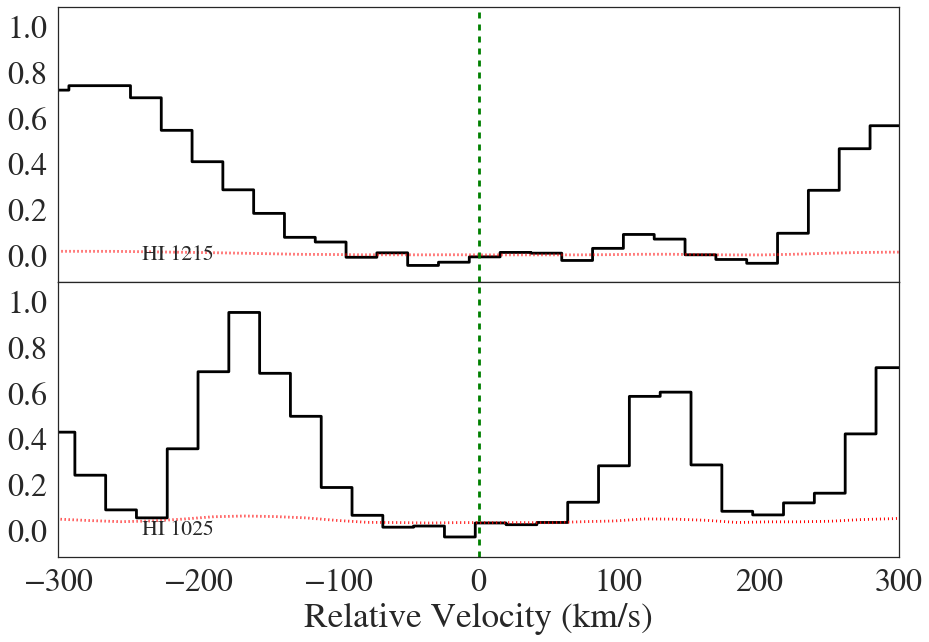

Examples for the AbsComopnent Class (v0.2)
==========================================

.. code:: python

    %matplotlib inline

.. code:: python

    # import
    try:
        import seaborn as sns; sns.set_style("white")
    except:
        pass
    
    from linetools.isgm import abscomponent as lt_abscomp
    from linetools.spectralline import AbsLine
    from linetools.spectra import io as lsio
    #
    import imp
    lt_path = imp.find_module('linetools')[1]

.. parsed-literal::

    /Users/xavier/anaconda/lib/python2.7/site-packages/matplotlib/__init__.py:872: UserWarning: axes.color_cycle is deprecated and replaced with axes.prop_cycle; please use the latter.
      warnings.warn(self.msg_depr % (key, alt_key))

Instantiate
-----------

Standard
~~~~~~~~

.. code:: python

    abscomp = lt_abscomp.AbsComponent((10.0*u.deg, 45*u.deg), (14,2), 1.0, [-300,300]*u.km/u.s)
    abscomp

.. parsed-literal::

    [AbsComponent: 00:40:00 +45:00:00, Zion=(14,2), z=1]

From AbsLines
~~~~~~~~~~~~~

From one line
^^^^^^^^^^^^^

.. code:: python

    lya = AbsLine(1215.670*u.AA)
    lya.analy['vlim'] = [-300.,300.]*u.km/u.s
    lya.attrib['z'] = 2.92939

.. parsed-literal::

    WARNING: UnitsWarning: The unit 'Angstrom' has been deprecated in the FITS standard. Suggested: 10**-1 nm. [astropy.units.format.utils]
    WARNING:astropy:UnitsWarning: The unit 'Angstrom' has been deprecated in the FITS standard. Suggested: 10**-1 nm.

.. parsed-literal::

    linetools.lists.parse: Reading linelist --- 
       /Users/xavier/local/Python/linetools/linetools/data/lines/morton03_table2.fits.gz
    linetools.lists.parse: Reading linelist --- 
       /Users/xavier/local/Python/linetools/linetools/data/lines/morton00_table2.fits.gz
    linetools.lists.parse: Reading linelist --- 
       /Users/xavier/local/Python/linetools/linetools/data/lines/verner94_tab6.fits

.. parsed-literal::

    WARNING: UnitsWarning: '0.1nm' did not parse as fits unit: Numeric factor not supported by FITS [astropy.units.core]
    WARNING:astropy:UnitsWarning: '0.1nm' did not parse as fits unit: Numeric factor not supported by FITS

.. parsed-literal::

    
    linetools.lists.parse: Reading linelist --- 
       /Users/xavier/local/Python/linetools/linetools/data/lines/EUV_lines.ascii
    read_sets: Using set file -- 
      /Users/xavier/local/Python/linetools/linetools/lists/sets/llist_v0.3.ascii

.. code:: python

    reload(lt_abscomp)
    abscomp = lt_abscomp.AbsComponent.from_abslines([lya])
    print(abscomp)
    abscomp._abslines

.. parsed-literal::

    [AbsComponent: 00:00:00 +00:00:00, Zion=(1,1), z=2.92939]

.. parsed-literal::

    [[AbsLine: HI 1215, wrest=1215.6700 Angstrom]]

From multiple
^^^^^^^^^^^^^

.. code:: python

    lyb = AbsLine(1025.7222*u.AA)
    lyb.analy['vlim'] = [-300.,300.]*u.km/u.s
    lyb.attrib['z'] = lya.attrib['z']

.. code:: python

    reload(lt_abscomp)
    abscomp = lt_abscomp.AbsComponent.from_abslines([lya,lyb])
    print(abscomp)
    abscomp._abslines

.. parsed-literal::

    [AbsComponent: 00:00:00 +00:00:00, Zion=(1,1), z=2.92939]

.. parsed-literal::

    [[AbsLine: HI 1215, wrest=1215.6700 Angstrom],
     [AbsLine: HI 1025, wrest=1025.7222 Angstrom]]

Methods
-------

Generate a Component Table
~~~~~~~~~~~~~~~~~~~~~~~~~~

.. code:: python

    lya.attrib['logN'] = 14.1
    lya.attrib['sig_logN'] = 0.15
    lya.attrib['flagN'] = 1
    lyb.attrib['logN'] = 14.15
    lyb.attrib['sig_logN'] = 0.19
    lyb.attrib['flagN'] = 1

.. code:: python

    reload(lt_abscomp)
    abscomp = lt_abscomp.AbsComponent.from_abslines([lya,lyb])
    comp_tbl = abscomp.build_table()
    comp_tbl

.. raw:: html

    &lt;QTable length=2&gt;
    <table id="table4557201808">
    <thead><tr><th>wrest</th><th>z</th><th>flagN</th><th>logN</th><th>sig_logN</th></tr></thead>
    <thead><tr><th>Angstrom</th><th></th><th></th><th></th><th></th></tr></thead>
    <thead><tr><th>float64</th><th>float64</th><th>int64</th><th>float64</th><th>float64</th></tr></thead>
    <tr><td>1215.67</td><td>2.92939</td><td>1</td><td>14.1</td><td>0.15</td></tr>
    <tr><td>1025.7222</td><td>2.92939</td><td>1</td><td>14.15</td><td>0.19</td></tr>
    </table>

Synthesize multiple components
~~~~~~~~~~~~~~~~~~~~~~~~~~~~~~

.. code:: python

    SiIItrans = ['SiII 1260', 'SiII 1304', 'SiII 1526']
    SiIIlines = []
    for trans in SiIItrans:
        iline = AbsLine(trans)
        iline.attrib['logN'] = 12.8 + np.random.rand()
        iline.attrib['sig_logN'] = 0.15
        iline.attrib['flagN'] = 1
        iline.attrib['z'] = 1.2
        iline.analy['vlim'] = [-300.,50.]*u.km/u.s
        SiIIlines.append(iline)
    SiIIcomp = lt_abscomp.AbsComponent.from_abslines(SiIIlines)

.. code:: python

    SiIIlines2 = []
    for trans in SiIItrans:
        iline = AbsLine(trans)
        iline.attrib['logN'] = 13.3 + np.random.rand()
        iline.attrib['sig_logN'] = 0.15
        iline.attrib['flagN'] = 1
        iline.attrib['z'] = 1.2
        iline.analy['vlim'] = [50.,300.]*u.km/u.s
        SiIIlines2.append(iline)
    SiIIcomp2 = lt_abscomp.AbsComponent.from_abslines(SiIIlines2)

.. code:: python

    reload(lt_abscomp)
    
    synthSiII = 

Generate an Ion Table
~~~~~~~~~~~~~~~~~~~~~

.. code:: python

    comps = [abscomp,SiIIcomp,abscomp]

.. code:: python

    dum = AbsLine('CII* 1335')
    dum.data

.. parsed-literal::

    {'A': <Quantity 288000000.0 1 / s>,
     'Am': 0,
     'Ej': <Quantity 63.42 1 / cm>,
     'Ek': <Quantity 74930.1 1 / cm>,
     'Ex': <Quantity 0.0 1 / cm>,
     'Jj': 0.0,
     'Jk': 0.0,
     'Ref': 'Morton2003',
     'Z': 6,
     'col0': masked,
     'col6': masked,
     'el': 0,
     'f': 0.115,
     'gamma': <Quantity 288000000.0 1 / s>,
     'gj': 4,
     'gk': 6,
     'group': 1,
     'ion': 2,
     'mol': '',
     'name': 'CII* 1335',
     'nj': 0,
     'nk': 0,
     'wrest': <Quantity 1335.7077 Angstrom>}

.. code:: python

    all(x.A is None for x in comps)

.. parsed-literal::

    True

.. code:: python

    print(SiIIcomp.Ej)

.. parsed-literal::

    0.0 1 / cm

.. code:: python

    tmp = np.array([comp.Zion[0]*100+comp.Zion[1] for comp in comps])
    tmp

.. parsed-literal::

    array([ 101, 1402,  101])

.. code:: python

    uni,idx = np.unique(tmp,return_index=True)
    print(uni,idx)
    print('Z', [iuni//100 for iuni in uni])
    print('ion', [iuni%100 for iuni in uni])

.. parsed-literal::

    (array([ 101, 1402]), array([0, 1]))
    ('Z', [1, 14])
    ('ion', [1, 2])

Stack Plot
~~~~~~~~~~

Load a spectrum
^^^^^^^^^^^^^^^

.. code:: python

    xspec = lsio.readspec(lt_path+'/spectra/tests/files/UM184_nF.fits')
    lya.analy['spec'] = xspec
    lyb.analy['spec'] = xspec

Show
^^^^

.. code:: python

    reload(lt_abscomp)
    abscomp = lt_abscomp.AbsComponent.from_abslines([lya,lyb])
    abscomp.stack_plot()

