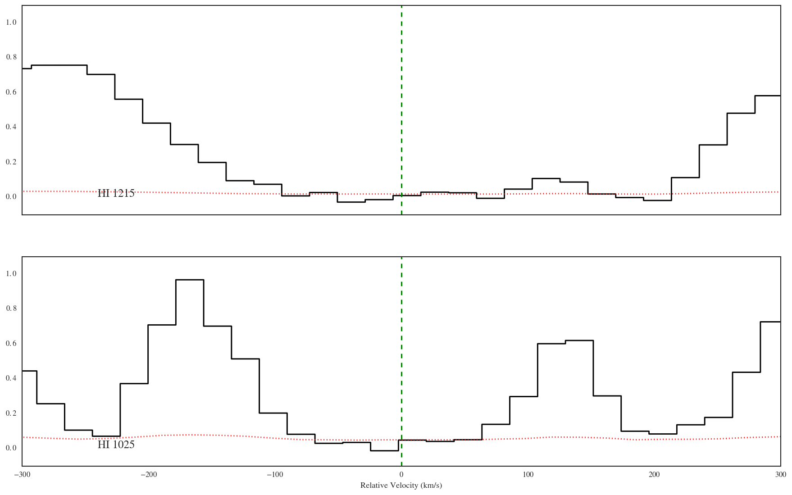

Examples for the AbsComponent Class (v0.3)
==========================================

:download:`Download <examples/AbsComponent_examples.ipynb>` this notebook.

.. code:: python

    %matplotlib inline
    
    # suppress warnings for these examples
    import warnings
    warnings.filterwarnings('ignore')

.. code:: python

    # import
    try:
        import seaborn as sns; sns.set_style("white")
    except:
        pass
    
    import astropy.units as u
    from linetools.spectralline import AbsLine
    from linetools.isgm import utils as ltiu
    from linetools.analysis import absline as laa
    from linetools.spectra import io as lsio
    from linetools.isgm.abscomponent import AbsComponent
    
    import imp
    lt_path = imp.find_module('linetools')[1]

Instantiate
-----------

Standard
~~~~~~~~

.. code:: python

    abscomp = AbsComponent((10.0*u.deg, 45*u.deg), (14,2), 1.0, [-300,300]*u.km/u.s)
    abscomp

.. parsed-literal::

    <AbsComponent: 00:40:00 +45:00:00, Name=SiII_z1.00000, Zion=(14,2), Ej=0 1 / cm, z=1, vlim=-300 km / s,300 km / s>

From AbsLines
~~~~~~~~~~~~~

From one line
^^^^^^^^^^^^^

.. code:: python

    lya = AbsLine(1215.670*u.AA)
    lya.analy['vlim'] = [-300.,300.]*u.km/u.s
    lya.attrib['z'] = 2.92939

.. code:: python

    abscomp = AbsComponent.from_abslines([lya])
    print(abscomp)
    abscomp._abslines

.. parsed-literal::

    <AbsComponent: 00:00:00 +00:00:00, Name=HI_z2.92939, Zion=(1,1), Ej=0 1 / cm, z=2.92939, vlim=-300 km / s,300 km / s>

.. parsed-literal::

    [<AbsLine: HI 1215, wrest=1215.6700 Angstrom>]

From multiple
^^^^^^^^^^^^^

.. code:: python

    lyb = AbsLine(1025.7222*u.AA)
    lyb.analy['vlim'] = [-300.,300.]*u.km/u.s
    lyb.attrib['z'] = lya.attrib['z']

.. code:: python

    abscomp = AbsComponent.from_abslines([lya,lyb])
    print(abscomp)
    abscomp._abslines

.. parsed-literal::

    <AbsComponent: 00:00:00 +00:00:00, Name=HI_z2.92939, Zion=(1,1), Ej=0 1 / cm, z=2.92939, vlim=-300 km / s,300 km / s>

.. parsed-literal::

    [<AbsLine: HI 1215, wrest=1215.6700 Angstrom>,
     <AbsLine: HI 1025, wrest=1025.7222 Angstrom>]

Methods
-------

Generate a Component Table
~~~~~~~~~~~~~~~~~~~~~~~~~~

.. code:: python

    lya.attrib['logN'] = 14.1
    lya.attrib['sig_logN'] = 0.15
    lya.attrib['flag_N'] = 1
    laa.linear_clm(lya.attrib)
    lyb.attrib['logN'] = 14.15
    lyb.attrib['sig_logN'] = 0.19
    lyb.attrib['flag_N'] = 1
    laa.linear_clm(lyb.attrib)

.. parsed-literal::

    (<Quantity 141253754462275.53 1 / cm2>, <Quantity 61797269977312.6 1 / cm2>)

.. code:: python

    abscomp = AbsComponent.from_abslines([lya,lyb])
    comp_tbl = abscomp.build_table()
    comp_tbl

.. raw:: html

    &lt;QTable length=2&gt;
    <table id="table4496182240">
    <thead><tr><th>wrest</th><th>z</th><th>flag_N</th><th>logN</th><th>sig_logN</th></tr></thead>
    <thead><tr><th>Angstrom</th><th></th><th></th><th></th><th></th></tr></thead>
    <thead><tr><th>float64</th><th>float64</th><th>int64</th><th>float64</th><th>float64</th></tr></thead>
    <tr><td>1215.67</td><td>2.92939</td><td>1</td><td>14.1</td><td>0.15</td></tr>
    <tr><td>1025.7222</td><td>2.92939</td><td>1</td><td>14.15</td><td>0.19</td></tr>
    </table>

Synthesize multiple components
~~~~~~~~~~~~~~~~~~~~~~~~~~~~~~

.. code:: python

    SiIItrans = ['SiII 1260', 'SiII 1304', 'SiII 1526']
    SiIIlines = []
    for trans in SiIItrans:
        iline = AbsLine(trans)
        iline.attrib['logN'] = 12.8 + np.random.rand()
        iline.attrib['sig_logN'] = 0.15
        iline.attrib['flag_N'] = 1
        iline.attrib['z'] = 2.92939
        iline.analy['vlim'] = [-300.,50.]*u.km/u.s
        _,_ = laa.linear_clm(iline.attrib)
        SiIIlines.append(iline)
    SiIIcomp = AbsComponent.from_abslines(SiIIlines)
    SiIIcomp.synthesize_colm()

.. code:: python

    SiIIlines2 = []
    for trans in SiIItrans:
        iline = AbsLine(trans)
        iline.attrib['logN'] = 13.3 + np.random.rand()
        iline.attrib['sig_logN'] = 0.15
        iline.attrib['flag_N'] = 1
        iline.attrib['z'] = 2.92939
        iline.analy['vlim'] = [50.,300.]*u.km/u.s
        _,_ = laa.linear_clm(iline.attrib)
        SiIIlines2.append(iline)
    SiIIcomp2 = AbsComponent.from_abslines(SiIIlines2)
    SiIIcomp2.synthesize_colm()

.. code:: python

    abscomp.synthesize_colm()
    [abscomp,SiIIcomp,SiIIcomp2]

.. parsed-literal::

    [<AbsComponent: 00:00:00 +00:00:00, Name=HI_z2.92939, Zion=(1,1), Ej=0 1 / cm, z=2.92939, vlim=-300 km / s,300 km / s, logN=14.1172, sig_N=0.117912, flag_N=1>,
     <AbsComponent: 00:00:00 +00:00:00, Name=SiII_z2.92939, Zion=(14,2), Ej=0 1 / cm, z=2.92939, vlim=-300 km / s,50 km / s, logN=12.9226, sig_N=0.112727, flag_N=1>,
     <AbsComponent: 00:00:00 +00:00:00, Name=SiII_z2.92939, Zion=(14,2), Ej=0 1 / cm, z=2.92939, vlim=50 km / s,300 km / s, logN=13.8523, sig_N=0.0897197, flag_N=1>]

.. code:: python

    synth_SiII = ltiu.synthesize_components([SiIIcomp,SiIIcomp2])
    synth_SiII

.. parsed-literal::

    <AbsComponent: 00:00:00 +00:00:00, Name=SiII_z2.92939, Zion=(14,2), Ej=0 1 / cm, z=2.92939, vlim=-300 km / s,300 km / s, logN=13.9006, sig_N=0.0811523, flag_N=1>

Generate multiple components from abslines
~~~~~~~~~~~~~~~~~~~~~~~~~~~~~~~~~~~~~~~~~~

.. code:: python

    comps = ltiu.build_components_from_abslines([lya,lyb,SiIIlines[0],SiIIlines[1]])
    comps

.. parsed-literal::

    [<AbsComponent: 00:00:00 +00:00:00, Name=HI_z2.92939, Zion=(1,1), Ej=0 1 / cm, z=2.92939, vlim=-300 km / s,300 km / s>,
     <AbsComponent: 00:00:00 +00:00:00, Name=SiII_z2.92939, Zion=(14,2), Ej=0 1 / cm, z=2.92939, vlim=-300 km / s,50 km / s>]

Generate an Ion Table
~~~~~~~~~~~~~~~~~~~~~

.. code:: python

    tbl = ltiu.iontable_from_components([abscomp,SiIIcomp,SiIIcomp2])
    tbl

.. raw:: html

    &lt;QTable length=2&gt;
    <table id="table4499067512">
    <thead><tr><th>Z</th><th>ion</th><th>A</th><th>Ej</th><th>z</th><th>vmin</th><th>vmax</th><th>flag_N</th><th>logN</th><th>sig_logN</th></tr></thead>
    <thead><tr><th></th><th></th><th></th><th></th><th></th><th>km / s</th><th>km / s</th><th></th><th></th><th></th></tr></thead>
    <thead><tr><th>int64</th><th>int64</th><th>int64</th><th>float64</th><th>float64</th><th>float64</th><th>float64</th><th>int64</th><th>float64</th><th>float64</th></tr></thead>
    <tr><td>1</td><td>1</td><td>0</td><td>0.0</td><td>2.92939</td><td>-300.0</td><td>300.0</td><td>1</td><td>14.1172024817</td><td>0.117911610801</td></tr>
    <tr><td>14</td><td>2</td><td>0</td><td>0.0</td><td>2.92939</td><td>-300.0</td><td>300.0</td><td>1</td><td>13.9006157733</td><td>0.0811522506077</td></tr>
    </table>

Stack plot
~~~~~~~~~~

Load a spectrum
^^^^^^^^^^^^^^^

.. code:: python

    xspec = lsio.readspec(lt_path+'/spectra/tests/files/UM184_nF.fits')
    lya.analy['spec'] = xspec
    lyb.analy['spec'] = xspec

Show
^^^^

.. code:: python

    abscomp = AbsComponent.from_abslines([lya,lyb])
    abscomp.stack_plot()

