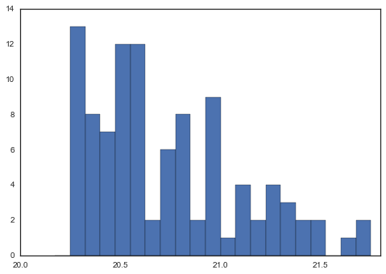

Examples for the DLASystem Class (v1.0)
=======================================

.. code:: python

    %matplotlib inline

.. code:: python

    # imports
    try:
        import seaborn as sns; sns.set_style("white")
    except:
        pass
    
    from linetools.spectra.xspectrum1d import XSpectrum1D
    from linetools.isgm.dla import DLASystem, DLASurvey

.. parsed-literal::

    /Users/xavier/anaconda/lib/python2.7/site-packages/matplotlib/__init__.py:872: UserWarning: axes.color_cycle is deprecated and replaced with axes.prop_cycle; please use the latter.
      warnings.warn(self.msg_depr % (key, alt_key))

Simple Instantiate
------------------

.. code:: python

    dla = DLASystem((0.*u.deg, 0.*u.deg), 2.5, None, NHI=20.55)
    dla

.. parsed-literal::

    [DLASystem: 00:00:00 00:00:00, 2.5, NHI=20.55, Z/H=0]

From a JXP .dat file
--------------------

(use of these .dat files is no longer recommended)

.. code:: python

    dla = DLASystem.from_datfile('Data/PH957.z2309.dat', tree=os.environ.get('DLA'))
    dla

.. parsed-literal::

    [DLASystem: 01:03:11.38 13:16:16.7, 2.309, NHI=21.37, Z/H=-1.41]

.. code:: python

    dla._datdict

.. parsed-literal::

    OrderedDict([(u'QSO name', u'PH957'),
                 (u'RA (2000)', u'01:03:11.38'),
                 (u'DEC (2000)', u'+13:16:16.7'),
                 (u'QSO zem', u'2.690000'),
                 (u'flg_QSOmag', u'2'),
                 (u'QSO Mag', u'16.600000'),
                 (u'zabs', u'2.309000000'),
                 (u'NHI', u'21.370'),
                 (u'sig(NHI)', u'0.080 0.000'),
                 (u'Abund file', u'Abund/PH957.z2309.clm'),
                 (u'flg_Fe', u'1'),
                 (u'[Fe/H]', u'-1.849'),
                 (u'sig(Fe)', u'0.042'),
                 (u'flg_Zn', u'1'),
                 (u'[Zn/H]', u'-1.554'),
                 (u'sig(Zn)', u'0.021'),
                 (u'flg_Alpha', u'4'),
                 (u'[Alpha/H]', u'-1.410'),
                 (u'sig(Alpha)', u'0.010'),
                 (u'flg_low', u'1'),
                 (u'hi res file', u'/HIRES/RedData/PH957/PH957_f.fits'),
                 (u'low_wav', u'1741.5490'),
                 (u'low_vmn,vmx (2f7)', u'-25.0   80.0'),
                 (u'fdelv', u'56.00'),
                 (u'fmm', u'0.36'),
                 (u'fedg', u'0.36'),
                 (u'ftpk', u'0.56'),
                 (u'flg_CII', u'9'),
                 (u'N(CII*)', u'13.590'),
                 (u'sig(CII*)', u'0.050'),
                 (u'flg_civ', u'1'),
                 (u'civ hi res file', u'/HIRES/RedData/PH957/PH957_f.fits'),
                 (u'civ_wav', u'1548.1950'),
                 (u'civ_vmn,vmx (2f7)', u'-60.0  100.0'),
                 (u'civ fdelv', u'104.01'),
                 (u'civ fmm', u'0.23'),
                 (u'civ fedg', u'0.69'),
                 (u'civ ftpk', u'-0.62'),
                 (u'civ fdv', u'-1.86'),
                 (u'civ frto', u'1.93'),
                 (u'civ fnmm', u'-0.04'),
                 (u'civ ftvm', u'10.89'),
                 (u'E(B-V)', u'0.035'),
                 (u'Filt 124816', u'0'),
                 (u'Slit 0n1s2y', u'0'),
                 (u'QSO Survey', u'3'),
                 (u'Survey Mag', u'16.60'),
                 (u'References', u'W94, PW99, P01, WPRR08'),
                 (u'flg_mtl', u'4'),
                 (u'[M/H]', u'-1.410'),
                 (u'sig([M/H])', u'0.081'),
                 (u'SDSS plt,fib,mjd', u'0,    0,     0'),
                 (u'VPFIT FILE', u''),
                 (u'flg_CI', u'0'),
                 (u'N(CI)', u''),
                 (u'sig(CI)', u''),
                 (u'flg_H2', u'0'),
                 (u'N(H2)', u''),
                 (u'sig(H2)', u'')])

Load up ions
~~~~~~~~~~~~

.. code:: python

    dla.tree

.. parsed-literal::

    '/u/xavier/DLA/'

.. code:: python

    clm_fil = dla.tree+dla._datdict['Abund file']
    print(clm_fil)
    dla.get_ions(use_clmfile=True)

.. parsed-literal::

    WARNING: UnitsWarning: The unit 'Angstrom' has been deprecated in the FITS standard. Suggested: 10**-1 nm. [astropy.units.format.utils]
    WARNING:astropy:UnitsWarning: The unit 'Angstrom' has been deprecated in the FITS standard. Suggested: 10**-1 nm.

.. parsed-literal::

    /u/xavier/DLA/Abund/PH957.z2309.clm
    linetools.lists.parse: Reading linelist --- 
       /Users/xavier/local/Python/linetools/linetools/data/lines/morton03_table2.fits.gz
    linetools.lists.parse: Reading linelist --- 
       /Users/xavier/local/Python/linetools/linetools/data/lines/morton00_table2.fits.gz
    linetools.lists.parse: Reading linelist --- 
       /Users/xavier/local/Python/linetools/linetools/data/lines/verner94_tab6.fits

.. parsed-literal::

    WARNING: UnitsWarning: '0.1nm' did not parse as fits unit: Numeric factor not supported by FITS [astropy.units.core]
    WARNING:astropy:UnitsWarning: '0.1nm' did not parse as fits unit: Numeric factor not supported by FITS

.. parsed-literal::

    
    linetools.lists.parse: Reading linelist --- 
       /Users/xavier/local/Python/linetools/linetools/data/lines/EUV_lines.ascii
    read_sets: Using set file -- 
      /Users/xavier/local/Python/linetools/linetools/lists/sets/llist_v0.4.ascii
    WARNING: Using 1467.2590 Angstrom for your input 1466.2120 Angstrom
    WARNING: Using 1703.4119 Angstrom for your input 1703.4050 Angstrom

.. parsed-literal::

    /Users/xavier/local/Python/linetools/linetools/isgm/abscomponent.py:188: UserWarning: Input absline with wrest=1454.84 Angstrom does not match component rules. Not appending
      warnings.warn('Input absline with wrest={:g} does not match component rules. Not appending'.format(absline.wrest))
    /Users/xavier/local/Python/linetools/linetools/isgm/abscomponent.py:188: UserWarning: Input absline with wrest=1741.55 Angstrom does not match component rules. Not appending
      warnings.warn('Input absline with wrest={:g} does not match component rules. Not appending'.format(absline.wrest))
    /Users/xavier/local/Python/linetools/linetools/isgm/abscomponent.py:188: UserWarning: Input absline with wrest=2062.66 Angstrom does not match component rules. Not appending
      warnings.warn('Input absline with wrest={:g} does not match component rules. Not appending'.format(absline.wrest))

.. parsed-literal::

    
    WARNING: Using 1910.6123 Angstrom for your input 1910.6000 Angstrom

.. code:: python

    dla._ionN

.. raw:: html

    &lt;QTable length=13&gt;
    <table id="table4554630672">
    <thead><tr><th>Z</th><th>ion</th><th>A</th><th>Ej</th><th>z</th><th>vmin</th><th>vmax</th><th>flag_N</th><th>logN</th><th>sig_logN</th></tr></thead>
    <thead><tr><th></th><th></th><th></th><th></th><th></th><th>km / s</th><th>km / s</th><th></th><th></th><th></th></tr></thead>
    <thead><tr><th>int64</th><th>int64</th><th>int64</th><th>float64</th><th>float64</th><th>float64</th><th>float64</th><th>int64</th><th>float64</th><th>float64</th></tr></thead>
    <tr><td>6</td><td>1</td><td>0</td><td>0.0</td><td>2.309</td><td>-30.0</td><td>40.0</td><td>3</td><td>12.35</td><td>0.0</td></tr>
    <tr><td>6</td><td>2</td><td>0</td><td>63.42</td><td>2.309</td><td>0.0</td><td>0.0</td><td>0</td><td>0.0</td><td>0.0</td></tr>
    <tr><td>6</td><td>4</td><td>0</td><td>0.0</td><td>2.309</td><td>-50.0</td><td>120.0</td><td>1</td><td>13.255</td><td>0.028</td></tr>
    <tr><td>8</td><td>1</td><td>0</td><td>0.0</td><td>2.309</td><td>-20.0</td><td>80.0</td><td>3</td><td>17.644</td><td>0.0</td></tr>
    <tr><td>12</td><td>1</td><td>0</td><td>0.0</td><td>2.309</td><td>-20.0</td><td>40.0</td><td>1</td><td>12.338</td><td>0.132</td></tr>
    <tr><td>13</td><td>3</td><td>0</td><td>0.0</td><td>2.309</td><td>-20.0</td><td>80.0</td><td>1</td><td>12.653</td><td>0.019</td></tr>
    <tr><td>14</td><td>2</td><td>0</td><td>0.0</td><td>2.309</td><td>-33.0</td><td>90.0</td><td>2</td><td>14.595</td><td>0.247</td></tr>
    <tr><td>14</td><td>4</td><td>0</td><td>0.0</td><td>2.309</td><td>-50.0</td><td>100.0</td><td>1</td><td>13.133</td><td>0.015</td></tr>
    <tr><td>22</td><td>2</td><td>0</td><td>0.0</td><td>2.309</td><td>-40.0</td><td>40.0</td><td>3</td><td>12.508</td><td>0.0</td></tr>
    <tr><td>24</td><td>2</td><td>0</td><td>0.0</td><td>2.309</td><td>-20.0</td><td>40.0</td><td>1</td><td>13.389</td><td>0.015</td></tr>
    <tr><td>26</td><td>2</td><td>0</td><td>0.0</td><td>2.309</td><td>-20.0</td><td>90.0</td><td>1</td><td>14.971</td><td>0.042</td></tr>
    <tr><td>28</td><td>2</td><td>0</td><td>0.0</td><td>2.309</td><td>-20.0</td><td>50.0</td><td>1</td><td>13.844</td><td>0.012</td></tr>
    <tr><td>30</td><td>2</td><td>0</td><td>0.0</td><td>2.309</td><td>-20.0</td><td>30.0</td><td>1</td><td>12.446</td><td>0.021</td></tr>
    </table>

Survey
------

.. code:: python

    dlas = DLASurvey.default_sample()

.. parsed-literal::

    Read 100 files from Lists/Neeleman13.lst in the tree /u/xavier/DLA/

.. code:: python

    xdb.xhist(dlas.NHI)

.. code:: python

    dlas.fill_ions(use_clmfile=True)

.. parsed-literal::

    WARNING: Using 2056.2569 Angstrom for your input 2056.2539 Angstrom
    WARNING: Using 1532.5330 Angstrom for your input 1533.4312 Angstrom
    WARNING: Using 1250.5780 Angstrom for your input 1250.5840 Angstrom
    WARNING: Using 1253.8050 Angstrom for your input 1253.8110 Angstrom
    WARNING: Using 1467.2590 Angstrom for your input 1466.2120 Angstrom
    WARNING: Using 1560.6820 Angstrom for your input 1574.5503 Angstrom
    WARNING: Using 1250.5780 Angstrom for your input 1250.5840 Angstrom
    WARNING: Using 1253.8050 Angstrom for your input 1253.8110 Angstrom
    WARNING: Using 1703.4119 Angstrom for your input 1703.4050 Angstrom
    WARNING: Using 1910.6123 Angstrom for your input 1910.6000 Angstrom
    WARNING: Using 2056.2569 Angstrom for your input 2056.2539 Angstrom
    WARNING: Using 1532.5330 Angstrom for your input 1533.4312 Angstrom
    WARNING: Using 1703.4119 Angstrom for your input 1703.4050 Angstrom
    WARNING: Using 1532.5330 Angstrom for your input 1533.4312 Angstrom
    WARNING: Using 1083.9937 Angstrom for your input 1083.9900 Angstrom
    WARNING: Using 1122.5240 Angstrom for your input 1122.5260 Angstrom
    WARNING: Using 1253.8050 Angstrom for your input 1253.8110 Angstrom
    WARNING: Using 1910.6123 Angstrom for your input 1910.6000 Angstrom
    WARNING: Using 2056.2569 Angstrom for your input 2056.2539 Angstrom
    WARNING: Using 1532.5330 Angstrom for your input 1533.4312 Angstrom
    WARNING: Using 1703.4119 Angstrom for your input 1703.4050 Angstrom
    WARNING: Using 1910.6123 Angstrom for your input 1910.6000 Angstrom
    WARNING: Using 2056.2569 Angstrom for your input 2056.2539 Angstrom
    WARNING: Using 1467.2590 Angstrom for your input 1466.2120 Angstrom
    WARNING: Using 1532.5330 Angstrom for your input 1533.4312 Angstrom
    WARNING: Using 1560.6820 Angstrom for your input 1574.5503 Angstrom
    WARNING: Using 2056.2569 Angstrom for your input 2056.2539 Angstrom
    WARNING: Using 1560.6820 Angstrom for your input 1574.5503 Angstrom
    WARNING: Using 1910.6123 Angstrom for your input 1910.7500 Angstrom
    WARNING: Using 2056.2569 Angstrom for your input 2056.2539 Angstrom
    WARNING: Using 1560.6820 Angstrom for your input 1574.5503 Angstrom
    WARNING: Using 1703.4119 Angstrom for your input 1703.4050 Angstrom
    WARNING: Using 1910.6123 Angstrom for your input 1910.7500 Angstrom
    WARNING: Using 2056.2569 Angstrom for your input 2056.2539 Angstrom
    WARNING: Using 1532.5330 Angstrom for your input 1533.4312 Angstrom
    WARNING: Using 2056.2569 Angstrom for your input 2056.2539 Angstrom
    WARNING: Using 1910.6123 Angstrom for your input 1910.7500 Angstrom
    WARNING: Using 1012.4950 Angstrom for your input 1012.5020 Angstrom
    WARNING: Using 1083.9937 Angstrom for your input 1083.9900 Angstrom
    WARNING: Using 1122.5240 Angstrom for your input 1122.5260 Angstrom
    WARNING: Using 2056.2569 Angstrom for your input 2056.2539 Angstrom
    WARNING: Using 1532.5330 Angstrom for your input 1533.4312 Angstrom
    WARNING: Using 1467.2590 Angstrom for your input 1466.2120 Angstrom
    WARNING: Using 1703.4119 Angstrom for your input 1703.4050 Angstrom
    WARNING: Using 1910.6123 Angstrom for your input 1910.6000 Angstrom
    WARNING: Using 1532.5330 Angstrom for your input 1533.4312 Angstrom
    WARNING: Using 1703.4119 Angstrom for your input 1703.4050 Angstrom
    WARNING: Using 1910.6123 Angstrom for your input 1910.6000 Angstrom
    WARNING: Using 2056.2569 Angstrom for your input 2056.2539 Angstrom
    WARNING: Using 1467.2590 Angstrom for your input 1466.2120 Angstrom
    WARNING: Using 1910.6123 Angstrom for your input 1910.7500 Angstrom
    WARNING: Using 1250.5780 Angstrom for your input 1250.5840 Angstrom
    WARNING: Using 1253.8050 Angstrom for your input 1253.8110 Angstrom
    WARNING: Using 1560.6820 Angstrom for your input 1574.5503 Angstrom
    WARNING: Using 1083.9937 Angstrom for your input 1083.9900 Angstrom
    WARNING: Using 1122.5240 Angstrom for your input 1122.5260 Angstrom
    WARNING: Using 1123.1350 Angstrom for your input 1125.4478 Angstrom
    WARNING: Using 1190.2030 Angstrom for your input 1190.2080 Angstrom
    WARNING: Using 1250.5780 Angstrom for your input 1250.5840 Angstrom
    WARNING: Using 1012.4950 Angstrom for your input 1012.5020 Angstrom
    WARNING: Using 1122.5240 Angstrom for your input 1122.5260 Angstrom
    WARNING: Using 1123.1350 Angstrom for your input 1125.4478 Angstrom
    WARNING: Using 1277.1900 Angstrom for your input 1277.2450 Angstrom
    WARNING: Using 1532.5330 Angstrom for your input 1533.4312 Angstrom
    WARNING: Using 1560.6820 Angstrom for your input 1574.5503 Angstrom
    WARNING: Using 1083.9937 Angstrom for your input 1083.9900 Angstrom
    WARNING: Using 1122.5240 Angstrom for your input 1122.5260 Angstrom
    WARNING: Using 1190.2030 Angstrom for your input 1190.2080 Angstrom
    WARNING: Using 1560.6820 Angstrom for your input 1574.5503 Angstrom
    WARNING: Using 1682.1274 Angstrom for your input 1682.1500 Angstrom
    WARNING: Using 1703.4119 Angstrom for your input 1703.4050 Angstrom
    WARNING: Using 1910.6123 Angstrom for your input 1910.6000 Angstrom
    WARNING: Using 1910.9538 Angstrom for your input 1910.9380 Angstrom
    WARNING: Using 2056.2569 Angstrom for your input 2056.2539 Angstrom
    WARNING: Using 1253.8050 Angstrom for your input 1253.8110 Angstrom
    WARNING: Using 1467.2590 Angstrom for your input 1466.2120 Angstrom
    WARNING: Using 1560.6820 Angstrom for your input 1574.5503 Angstrom
    WARNING: Using 1703.4119 Angstrom for your input 1703.4050 Angstrom
    WARNING: Using 1910.6123 Angstrom for your input 1910.6000 Angstrom
    WARNING: Using 2056.2569 Angstrom for your input 2056.2539 Angstrom
    WARNING: Using 2056.2569 Angstrom for your input 2056.2539 Angstrom
    WARNING: Using 1467.2590 Angstrom for your input 1466.2120 Angstrom
    WARNING: Using 2056.2569 Angstrom for your input 2056.2539 Angstrom
    WARNING: Using 1250.5780 Angstrom for your input 1250.5840 Angstrom
    WARNING: Using 1190.2030 Angstrom for your input 1190.2080 Angstrom
    WARNING: Using 1277.1900 Angstrom for your input 1277.2450 Angstrom
    WARNING: Using 1532.5330 Angstrom for your input 1533.4312 Angstrom
    WARNING: Using 1467.2590 Angstrom for your input 1466.2120 Angstrom
    WARNING: Using 1560.6820 Angstrom for your input 1574.5503 Angstrom
    WARNING: Using 2056.2569 Angstrom for your input 2056.2539 Angstrom
    WARNING: Using 1253.8050 Angstrom for your input 1253.8110 Angstrom
    WARNING: Using 1355.5977 Angstrom for your input 1347.2400 Angstrom
    WARNING: Using 1400.4400 Angstrom for your input 1400.4000 Angstrom
    WARNING: Using 1703.4119 Angstrom for your input 1703.4050 Angstrom
    WARNING: Using 1910.6123 Angstrom for your input 1910.6000 Angstrom
    WARNING: Using 2056.2569 Angstrom for your input 2056.2539 Angstrom
    WARNING: Using 1560.6820 Angstrom for your input 1574.5503 Angstrom
    WARNING: Using 1703.4119 Angstrom for your input 1703.4050 Angstrom
    WARNING: Using 2056.2569 Angstrom for your input 2056.2539 Angstrom
    WARNING: Using 1083.9937 Angstrom for your input 1083.9900 Angstrom
    WARNING: Using 1122.5240 Angstrom for your input 1122.5260 Angstrom
    WARNING: Using 1467.2590 Angstrom for your input 1466.2120 Angstrom
    WARNING: Using 1560.6820 Angstrom for your input 1574.5503 Angstrom
    WARNING: Using 1703.4119 Angstrom for your input 1703.4050 Angstrom
    WARNING: Using 1910.6123 Angstrom for your input 1910.7500 Angstrom
    WARNING: Using 2056.2569 Angstrom for your input 2056.2539 Angstrom
    WARNING: Using 1122.5240 Angstrom for your input 1122.5260 Angstrom
    WARNING: Using 1123.1350 Angstrom for your input 1125.4478 Angstrom
    WARNING: Using 1532.5330 Angstrom for your input 1533.4312 Angstrom
    WARNING: Using 1560.6820 Angstrom for your input 1574.5503 Angstrom
    WARNING: Using 1253.8050 Angstrom for your input 1253.8110 Angstrom
    WARNING: Using 1277.1900 Angstrom for your input 1277.2450 Angstrom
    WARNING: Using 1560.6820 Angstrom for your input 1574.5503 Angstrom
    WARNING: Using 1012.4950 Angstrom for your input 1012.5020 Angstrom
    WARNING: Using 1062.6640 Angstrom for your input 1062.6620 Angstrom
    WARNING: Using 1083.9937 Angstrom for your input 1083.9900 Angstrom
    WARNING: Using 1122.5240 Angstrom for your input 1122.5260 Angstrom
    WARNING: Using 1250.5780 Angstrom for your input 1250.5840 Angstrom
    WARNING: Using 1253.8050 Angstrom for your input 1253.8110 Angstrom
    WARNING: Using 1467.2590 Angstrom for your input 1466.2120 Angstrom
    WARNING: Using 1467.2590 Angstrom for your input 1466.2120 Angstrom
    WARNING: Using 1560.6820 Angstrom for your input 1574.5503 Angstrom
    WARNING: Using 1703.4119 Angstrom for your input 1703.4050 Angstrom
    WARNING: Using 1910.6123 Angstrom for your input 1910.7500 Angstrom
    WARNING: Using 2056.2569 Angstrom for your input 2056.2539 Angstrom
    WARNING: Using 1122.5240 Angstrom for your input 1122.5260 Angstrom
    WARNING: Using 1250.5780 Angstrom for your input 1250.5840 Angstrom
    WARNING: Using 1253.8050 Angstrom for your input 1253.8110 Angstrom
    WARNING: Using 1355.5977 Angstrom for your input 1347.2400 Angstrom
    WARNING: Using 2056.2569 Angstrom for your input 2056.2539 Angstrom
    WARNING: Using 2056.2569 Angstrom for your input 2056.2539 Angstrom
    WARNING: Using 1190.2030 Angstrom for your input 1190.2080 Angstrom
    WARNING: Using 1532.5330 Angstrom for your input 1533.4312 Angstrom
    WARNING: Using 1560.6820 Angstrom for your input 1574.5503 Angstrom
    WARNING: Using 1703.4119 Angstrom for your input 1703.4050 Angstrom
    WARNING: Using 1910.6123 Angstrom for your input 1910.7500 Angstrom
    WARNING: Using 2056.2569 Angstrom for your input 2056.2539 Angstrom
    WARNING: Using 1703.4119 Angstrom for your input 1703.4050 Angstrom
    WARNING: Using 2056.2569 Angstrom for your input 2056.2539 Angstrom
    WARNING: Using 1532.5330 Angstrom for your input 1533.4312 Angstrom
    WARNING: Using 1250.5780 Angstrom for your input 1250.5840 Angstrom
    WARNING: Using 1253.8050 Angstrom for your input 1253.8110 Angstrom
    WARNING: Using 1703.4119 Angstrom for your input 1703.4050 Angstrom
    WARNING: Using 2056.2569 Angstrom for your input 2056.2539 Angstrom
    WARNING: Using 1532.5330 Angstrom for your input 1533.4312 Angstrom
    WARNING: Using 1532.5330 Angstrom for your input 1533.4312 Angstrom
    WARNING: Using 1250.5780 Angstrom for your input 1250.5840 Angstrom
    WARNING: Using 2056.2569 Angstrom for your input 2056.2539 Angstrom
    WARNING: Using 1532.5330 Angstrom for your input 1533.4312 Angstrom
    WARNING: Using 1532.5330 Angstrom for your input 1533.4312 Angstrom
    WARNING: Using 1250.5780 Angstrom for your input 1250.5840 Angstrom
    WARNING: Using 1253.8050 Angstrom for your input 1253.8110 Angstrom
    WARNING: Using 2056.2569 Angstrom for your input 2056.2539 Angstrom
    WARNING: Using 1250.5780 Angstrom for your input 1250.5840 Angstrom
    WARNING: Using 1253.8050 Angstrom for your input 1253.8110 Angstrom
    WARNING: Using 2056.2569 Angstrom for your input 2056.2539 Angstrom
    WARNING: Using 1250.5780 Angstrom for your input 1250.5840 Angstrom
    WARNING: Using 1253.8050 Angstrom for your input 1253.8110 Angstrom
    WARNING: Using 2056.2569 Angstrom for your input 2056.2539 Angstrom
    WARNING: Using 1250.5780 Angstrom for your input 1250.5840 Angstrom
    WARNING: Using 1532.5330 Angstrom for your input 1533.4312 Angstrom
    WARNING: Using 2056.2569 Angstrom for your input 2056.2539 Angstrom
    WARNING: Using 1532.5330 Angstrom for your input 1533.4312 Angstrom
    WARNING: Using 1250.5780 Angstrom for your input 1250.5840 Angstrom
    WARNING: Using 1532.5330 Angstrom for your input 1533.4312 Angstrom
    WARNING: Using 2056.2569 Angstrom for your input 2056.2539 Angstrom
    WARNING: Using 1253.8050 Angstrom for your input 1253.8110 Angstrom
    WARNING: Using 2056.2569 Angstrom for your input 2056.2539 Angstrom
    WARNING: Using 1253.8050 Angstrom for your input 1253.8110 Angstrom
    WARNING: Using 1703.4119 Angstrom for your input 1703.4050 Angstrom
    WARNING: Using 1532.5330 Angstrom for your input 1533.4312 Angstrom
    WARNING: Using 2056.2569 Angstrom for your input 2056.2539 Angstrom
    WARNING: Using 2056.2569 Angstrom for your input 2056.2539 Angstrom
    WARNING: Using 1250.5780 Angstrom for your input 1250.5840 Angstrom
    WARNING: Using 1253.8050 Angstrom for your input 1253.8110 Angstrom
    WARNING: Using 1532.5330 Angstrom for your input 1533.4312 Angstrom
    WARNING: Using 2056.2569 Angstrom for your input 2056.2539 Angstrom
    WARNING: Using 1122.5240 Angstrom for your input 1122.5260 Angstrom
    WARNING: Using 1253.8050 Angstrom for your input 1253.8110 Angstrom
    WARNING: Using 1253.8050 Angstrom for your input 1253.8110 Angstrom
    WARNING: Using 1532.5330 Angstrom for your input 1533.4312 Angstrom
    WARNING: Using 1253.8050 Angstrom for your input 1253.8110 Angstrom
    WARNING: Using 1012.4950 Angstrom for your input 1012.5020 Angstrom
    WARNING: Using 1083.9937 Angstrom for your input 1083.9900 Angstrom
    WARNING: Using 1122.5240 Angstrom for your input 1122.5260 Angstrom
    WARNING: Using 1250.5780 Angstrom for your input 1250.5840 Angstrom
    WARNING: Using 1532.5330 Angstrom for your input 1533.4312 Angstrom
    WARNING: Using 2056.2569 Angstrom for your input 2056.2539 Angstrom
    WARNING: Using 1122.5240 Angstrom for your input 1122.5260 Angstrom
    WARNING: Using 1253.8050 Angstrom for your input 1253.8110 Angstrom
    WARNING: Using 1532.5330 Angstrom for your input 1533.4312 Angstrom
    WARNING: Using 1012.4950 Angstrom for your input 1012.5020 Angstrom
    WARNING: Using 1083.9937 Angstrom for your input 1083.9900 Angstrom
    WARNING: Using 1122.5240 Angstrom for your input 1122.5260 Angstrom
    WARNING: Using 1190.2030 Angstrom for your input 1190.2080 Angstrom
    WARNING: Using 1250.5780 Angstrom for your input 1250.5840 Angstrom
    WARNING: Using 1253.8050 Angstrom for your input 1253.8110 Angstrom
    WARNING: Using 1532.5330 Angstrom for your input 1533.4312 Angstrom
    WARNING: Using 1122.5240 Angstrom for your input 1122.5260 Angstrom
    WARNING: Using 1250.5780 Angstrom for your input 1250.5840 Angstrom
    WARNING: Using 1253.8050 Angstrom for your input 1253.8110 Angstrom

.. code:: python

    CII_clms = dlas.ions((6,4))
    CII_clms

.. raw:: html

    &lt;Table length=100&gt;
    <table id="table4632599824">
    <thead><tr><th>name</th><th>Z</th><th>ion</th><th>A</th><th>Ej</th><th>z</th><th>vmin</th><th>vmax</th><th>flag_N</th><th>logN</th><th>sig_logN</th></tr></thead>
    <thead><tr><th></th><th></th><th></th><th></th><th></th><th></th><th>km / s</th><th>km / s</th><th></th><th></th><th></th></tr></thead>
    <thead><tr><th>unicode32</th><th>int64</th><th>int64</th><th>int64</th><th>float64</th><th>float64</th><th>float64</th><th>float64</th><th>int64</th><th>float64</th><th>float64</th></tr></thead>
    <tr><td>PSS0209+05_z3.666</td><td>6</td><td>4</td><td>0</td><td>0.0</td><td>3.6662</td><td>-100.0</td><td>10.0</td><td>1</td><td>13.385</td><td>0.02</td></tr>
    <tr><td>PSS0209+05_z3.864</td><td>0</td><td>0</td><td>0</td><td>0.0</td><td>0.0</td><td>0.0</td><td>0.0</td><td>0</td><td>0.0</td><td>0.0</td></tr>
    <tr><td>PSS0957+33_z3.280</td><td>6</td><td>4</td><td>0</td><td>0.0</td><td>3.27958</td><td>-200.280207364</td><td>79.7197926357</td><td>1</td><td>13.974</td><td>0.009</td></tr>
    <tr><td>PSS0957+33_z4.180</td><td>0</td><td>0</td><td>0</td><td>0.0</td><td>0.0</td><td>0.0</td><td>0.0</td><td>0</td><td>0.0</td><td>0.0</td></tr>
    <tr><td>HS1132+2243_z2.783</td><td>6</td><td>4</td><td>0</td><td>0.0</td><td>2.78347</td><td>-70.0</td><td>30.0</td><td>1</td><td>13.019</td><td>0.044</td></tr>
    <tr><td>Q1209+0919_z2.584</td><td>6</td><td>4</td><td>0</td><td>0.0</td><td>2.5841</td><td>-300.0</td><td>300.0</td><td>2</td><td>14.999</td><td>0.066</td></tr>
    <tr><td>Q1337+11_z2.796</td><td>6</td><td>4</td><td>0</td><td>0.0</td><td>2.79585</td><td>-90.0</td><td>20.0</td><td>1</td><td>13.387</td><td>0.026</td></tr>
    <tr><td>PKS1354-17_z2.780</td><td>0</td><td>0</td><td>0</td><td>0.0</td><td>0.0</td><td>0.0</td><td>0.0</td><td>0</td><td>0.0</td><td>0.0</td></tr>
    <tr><td>PSS1506+522_z3.224</td><td>0</td><td>0</td><td>0</td><td>0.0</td><td>0.0</td><td>0.0</td><td>0.0</td><td>0</td><td>0.0</td><td>0.0</td></tr>
    <tr><td>...</td><td>...</td><td>...</td><td>...</td><td>...</td><td>...</td><td>...</td><td>...</td><td>...</td><td>...</td><td>...</td></tr>
    <tr><td>Q1055+46_z3.317</td><td>0</td><td>0</td><td>0</td><td>0.0</td><td>0.0</td><td>0.0</td><td>0.0</td><td>0</td><td>0.0</td><td>0.0</td></tr>
    <tr><td>Q1104-18_z1.661</td><td>0</td><td>0</td><td>0</td><td>0.0</td><td>0.0</td><td>0.0</td><td>0.0</td><td>0</td><td>0.0</td><td>0.0</td></tr>
    <tr><td>Q2223+20_z3.119</td><td>6</td><td>4</td><td>0</td><td>0.0</td><td>3.1192</td><td>-54.555858322</td><td>105.444141678</td><td>1</td><td>13.626</td><td>0.02</td></tr>
    <tr><td>Q2343+125_z2.431</td><td>6</td><td>4</td><td>0</td><td>0.0</td><td>2.4313</td><td>-400.0</td><td>200.0</td><td>1</td><td>14.714</td><td>0.001</td></tr>
    <tr><td>Q2344+12_z2.538</td><td>0</td><td>0</td><td>0</td><td>0.0</td><td>0.0</td><td>0.0</td><td>0.0</td><td>0</td><td>0.0</td><td>0.0</td></tr>
    <tr><td>Q0913+072_z2.618</td><td>6</td><td>4</td><td>0</td><td>0.0</td><td>2.6184</td><td>-25.0</td><td>240.0</td><td>1</td><td>14.106</td><td>0.012</td></tr>
    <tr><td>J1202+3235_z5.065</td><td>0</td><td>0</td><td>0</td><td>0.0</td><td>0.0</td><td>0.0</td><td>0.0</td><td>0</td><td>0.0</td><td>0.0</td></tr>
    <tr><td>Q0450-13_z2.067</td><td>6</td><td>4</td><td>0</td><td>0.0</td><td>2.0666</td><td>-140.0</td><td>160.0</td><td>2</td><td>14.946</td><td>0.067</td></tr>
    <tr><td>J1155+0530_z2.608</td><td>6</td><td>4</td><td>0</td><td>0.0</td><td>2.6077</td><td>-60.0</td><td>100.0</td><td>1</td><td>13.631</td><td>0.01</td></tr>
    <tr><td>J1435+5359_z2.343</td><td>6</td><td>4</td><td>0</td><td>0.0</td><td>2.3427</td><td>-100.0</td><td>80.0</td><td>1</td><td>13.847</td><td>0.004</td></tr>
    </table>

