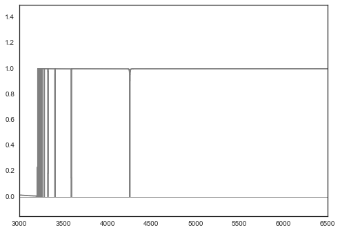

Examples for the LLSSystem Class (v1.1.1)
=========================================

.. code:: python

    %matplotlib inline

.. code:: python

    # imports
    try:
        import seaborn as sns; sns.set_style("white")
    except:
        pass
    
    from linetools.spectra.xspectrum1d import XSpectrum1D
    from linetools.isgm import lls as ltlls

.. parsed-literal::

    /Users/xavier/anaconda/lib/python2.7/site-packages/matplotlib/__init__.py:872: UserWarning: axes.color_cycle is deprecated and replaced with axes.prop_cycle; please use the latter.
      warnings.warn(self.msg_depr % (key, alt_key))

Simple Instantiate
------------------

.. code:: python

    reload(ltlls)
    lls = ltlls.LLSSystem((0.*u.deg, 0.*u.deg), 2.5, None, NHI=17.9)
    lls

.. parsed-literal::

    [LLSSystem: 00:00:00 +00:00:00, zabs=2.5, NHI=17.9, tau_LL=5.03537, [Z/H]=0 dex]

Generate/plot a model
---------------------

.. code:: python

    # Fill HI lines
    lls.fill_lls_lines()

.. parsed-literal::

    WARNING: UnitsWarning: The unit 'Angstrom' has been deprecated in the FITS standard. Suggested: 10**-1 nm. [astropy.units.format.utils]
    WARNING:astropy:UnitsWarning: The unit 'Angstrom' has been deprecated in the FITS standard. Suggested: 10**-1 nm.

.. parsed-literal::

    linetools.lists.parse: Reading linelist --- 
       /Users/xavier/local/Python/linetools/linetools/data/lines/morton03_table2.fits.gz
    read_sets: Using set file -- 
      /Users/xavier/local/Python/linetools/linetools/lists/sets/llist_v0.3.ascii

.. code:: python

    # Generate a spectrum
    wave = np.arange(3000., 6500)
    npix = len(wave)
    spec = XSpectrum1D.from_tuple((wave*u.AA,np.ones(npix)))

.. code:: python

    # Model
    model = lls.flux_model(spec)
    model.plot()

.. parsed-literal::

    /Users/xavier/local/Python/linetools/linetools/analysis/voigt.py:177: UserWarning: Using a sub-grid wavelength array because the input array is too coarse.
      warnings.warn('Using a sub-grid wavelength array because the input array is too coarse.')
    /Users/xavier/local/Python/linetools/linetools/analysis/voigt.py:178: UserWarning: Will return values rebinned to the input array.
      warnings.warn('Will return values rebinned to the input array.')
    /Users/xavier/local/Python/linetools/linetools/analysis/voigt.py:213: UserWarning: Rebinned tau back to your input array.  Reconsider input
      warnings.warn('Rebinned tau back to your input array.  Reconsider input')

From a JXP .dat file
--------------------

(use of these .dat files is no longer recommended)

.. code:: python

    reload(ltlls)
    datfil = 'Data/UM184.z2929.dat'
    lls = ltlls.LLSSystem.from_datfile(dat_file=datfil, tree=os.getenv('LLSTREE'))
    lls

.. parsed-literal::

    [LLSSystem: 23:50:57.87 -00:52:09.9, zabs=2.93012, NHI=18.5, tau_LL=20.0462, [Z/H]=0 dex]

.. code:: python

    print(lls.nsub)
    lls.subsys['A']._datdict

.. parsed-literal::

    1

.. parsed-literal::

    {u'Fe_H': 0.0,
     u'NH': 0.0,
     u'NHI': 18.5,
     u'NHIsig': array([ 1.1,  0.4]),
     u'NHsig': array([ 0.,  0.]),
     u'U': 0.0,
     u'Usig': array([ 0.,  0.]),
     u'VPFIT_file': u'',
     u'alpha_H': 0.0,
     u'bsig': 0.0,
     u'bval': 0.0,
     u'clm_file': u'Abund/UM184.z2929_MAGE.clm',
     u'flg_Fe': 0,
     u'flg_alpha': 0,
     u'flg_low': 0,
     u'logx': 0.0,
     u'sig_Fe_H': 0.0,
     u'sig_a_H': 0.0,
     u'sigx': array([ 0.,  0.]),
     u'zabs': 2.93}

.. code:: python

    lls._datdict

.. parsed-literal::

    OrderedDict([(u'QSO name', u'UM184'),
                 (u'RA (2000)', u'23:50:57.87'),
                 (u'DEC (2000)', u'-00:52:09.9'),
                 (u'QSO zem', u'3.021000'),
                 (u'flg_QSOmag', u'0'),
                 (u'QSO Mag', u'0.000000'),
                 (u'QSO Survey', u'0'),
                 (u'Survey', u'0.00000'),
                 (u'Referenc', u''),
                 (u'SDSS plt,fib,mjd', u'0     0      0'),
                 (u'zabs', u'2.93012'),
                 (u'NHI tot', u'18.5000'),
                 (u'NHI sig', u'1.1000   0.4000'),
                 (u'NH tot', u'0.0000'),
                 (u'NH sig', u'0.0000   0.0000'),
                 (u'vmn,vmx (2f7)', u'0.0    0.0'),
                 (u'fdelv', u'0.00'),
                 (u'fmm', u'0.00'),
                 (u'fedg', u'0.00'),
                 (u'ftpk', u'0.00'),
                 (u'flg_M/H', u'0'),
                 (u'[M/H] ave', u'0.00'),
                 (u'sig[M/H]', u'0.00'),
                 (u'flg_D/H', u'0'),
                 (u'[D/H]', u'0.000000'),
                 (u'N subsys', u'1'),
                 (u'Cloudy Grid File', u'dum.fil'),
                 (u'System A', u'A'),
                 (u'A zabs', u'2.930000'),
                 (u'A NHI', u'18.5000'),
                 (u'A NHIsig', u'1.1000    0.4000'),
                 (u'A NH', u'0.0000'),
                 (u'A NHsig', u'0.0000    0.0000'),
                 (u'A log x', u'0.0000'),
                 (u'A sigx', u'0.0000    0.0000'),
                 (u'A b', u'0.0000'),
                 (u'A bsig', u'0.0000'),
                 (u'A Abund file', u'Abund/UM184.z2929_MAGE.clm'),
                 (u'A U', u'0.00'),
                 (u'A Usig', u'0.0000    0.0000'),
                 (u'A flg_low', u'0'),
                 (u'A flg_alpha', u'0'),
                 (u'A [alpha/H]', u'0.000000'),
                 (u'A sig[a/H]', u'0.000000'),
                 (u'A flg_Fe', u'0'),
                 (u'A [Fe/H]', u'0.000000'),
                 (u'A sig[Fe/H]', u'0.000000'),
                 (u'A VPFIT file', u'')])

Load up ions
~~~~~~~~~~~~

.. code:: python

    lls.get_ions(use_clmfile=True)

.. parsed-literal::

    linetools.lists.parse: Reading linelist --- 
       /Users/xavier/local/Python/linetools/linetools/data/lines/morton03_table2.fits.gz
    linetools.lists.parse: Reading linelist --- 
       /Users/xavier/local/Python/linetools/linetools/data/lines/morton00_table2.fits.gz
    linetools.lists.parse: Reading linelist --- 
       /Users/xavier/local/Python/linetools/linetools/data/lines/verner94_tab6.fits

.. parsed-literal::

    WARNING: UnitsWarning: '0.1nm' did not parse as fits unit: Numeric factor not supported by FITS [astropy.units.core]
    WARNING:astropy:UnitsWarning: '0.1nm' did not parse as fits unit: Numeric factor not supported by FITS

.. parsed-literal::

    
    linetools.lists.parse: Reading linelist --- 
       /Users/xavier/local/Python/linetools/linetools/data/lines/EUV_lines.ascii
    read_sets: Using set file -- 
      /Users/xavier/local/Python/linetools/linetools/lists/sets/llist_v0.3.ascii
    WARNING: Using 1250.5780 Angstrom for your input 1250.5840 Angstrom
    WARNING: Using 1253.8050 Angstrom for your input 1253.8110 Angstrom
    WARNING: Using 2056.2569 Angstrom for your input 2056.2539 Angstrom

.. code:: python

    lls._ionN

.. raw:: html

    &lt;QTable length=13&gt;
    <table id="table4343188816">
    <thead><tr><th>Z</th><th>ion</th><th>A</th><th>Ej</th><th>z</th><th>vmin</th><th>vmax</th><th>flag_N</th><th>logN</th><th>sig_logN</th></tr></thead>
    <thead><tr><th></th><th></th><th></th><th></th><th></th><th>km / s</th><th>km / s</th><th></th><th></th><th></th></tr></thead>
    <thead><tr><th>int64</th><th>int64</th><th>int64</th><th>float64</th><th>float64</th><th>float64</th><th>float64</th><th>int64</th><th>float64</th><th>float64</th></tr></thead>
    <tr><td>6</td><td>1</td><td>0</td><td>0.0</td><td>2.93</td><td>-204.0</td><td>60.0</td><td>3</td><td>13.091</td><td>0.0</td></tr>
    <tr><td>6</td><td>2</td><td>0</td><td>0.0</td><td>2.93</td><td>-204.0</td><td>60.0</td><td>1</td><td>14.004</td><td>0.038</td></tr>
    <tr><td>6</td><td>4</td><td>0</td><td>0.0</td><td>2.93</td><td>-204.0</td><td>191.0</td><td>1</td><td>13.9</td><td>0.019</td></tr>
    <tr><td>8</td><td>1</td><td>0</td><td>0.0</td><td>2.93</td><td>-204.0</td><td>60.0</td><td>1</td><td>14.162</td><td>0.059</td></tr>
    <tr><td>13</td><td>2</td><td>0</td><td>0.0</td><td>2.93</td><td>-204.0</td><td>60.0</td><td>1</td><td>12.591</td><td>0.06</td></tr>
    <tr><td>13</td><td>3</td><td>0</td><td>0.0</td><td>2.93</td><td>-204.0</td><td>60.0</td><td>3</td><td>12.752</td><td>0.0</td></tr>
    <tr><td>14</td><td>2</td><td>0</td><td>0.0</td><td>2.93</td><td>-204.0</td><td>60.0</td><td>1</td><td>13.7</td><td>0.046</td></tr>
    <tr><td>14</td><td>4</td><td>0</td><td>0.0</td><td>2.93</td><td>-243.0</td><td>101.0</td><td>1</td><td>13.517</td><td>0.03</td></tr>
    <tr><td>16</td><td>2</td><td>0</td><td>0.0</td><td>2.93</td><td>-204.0</td><td>60.0</td><td>3</td><td>14.411</td><td>0.0</td></tr>
    <tr><td>24</td><td>2</td><td>0</td><td>0.0</td><td>2.93</td><td>-204.0</td><td>60.0</td><td>3</td><td>13.366</td><td>0.0</td></tr>
    <tr><td>26</td><td>2</td><td>0</td><td>0.0</td><td>2.93</td><td>-204.0</td><td>60.0</td><td>3</td><td>13.512</td><td>0.0</td></tr>
    <tr><td>28</td><td>2</td><td>0</td><td>0.0</td><td>2.93</td><td>-204.0</td><td>60.0</td><td>3</td><td>13.632</td><td>0.0</td></tr>
    <tr><td>30</td><td>2</td><td>0</td><td>0.0</td><td>2.93</td><td>-204.0</td><td>60.0</td><td>3</td><td>12.601</td><td>0.0</td></tr>
    </table>

