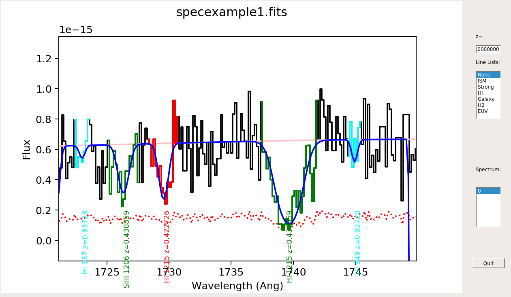

xspec Documentation
===================

:download:`Download <examples/xspecgui.ipynb>` this notebook.

This ipython Notebook is intended to provide documentation for the
linetools GUI named XSpecGUI.

Enjoy and feel free to suggest edits/additions, etc.

Here is a screenshot of the XSpecGUI in action:

.. code:: python

    from IPython.display import Image
    Image(filename="images/xspec_example.png")

.. image:: xspecgui_files/xspecgui_1_0.png

The example spectrum file used below is part of the linetools package.

.. code:: python

    import imp
    lt_path = imp.find_module('linetools')[1]
    spec_fil = lt_path+'/spectra/tests/files/PH957_f.fits'

Here is one another example, with guessfile option:

.. code:: python

    from IPython.display import Image
    Image(filename="images/xspecgui_guesses.png")

The example spectrum file and the example guesses file used below are part of the linetools package.

.. code:: python

    import imp
    lt_path = imp.find_module('linetools')[1]
    spec_fil = lt_path+'/spectra/tests/files/specexample1.fits'
    guess_fil = lt_path+'/spectra/tests/files/guessexample.json'

The gui could be called as

.. code:: python

    lt_xspec specexample1.fits -guessfile guessexample.json

Before Launching the GUI
------------------------

If you are a Mac user, we **highly** recommend that you set your
matplotlib backend from MacOSX to TkAgg (or another option, see
`backends <http://matplotlib.org/faq/usage_faq.html#what-is-a-backend>`__).

Launching the GUI
-----------------

From the command line (recommended)
~~~~~~~~~~~~~~~~~~~~~~~~~~~~~~~~~~~

We recommend you use the script provided with linetools.

Then it is as simple as:

::

    > lt_xspec filename 

Here are the current command-line options::

    > lt_xspec -h
    usage: lt_xspec [-h] [--zsys ZSYS] [--norm] [--exten EXTEN]
                    [--wave_tag WAVE_TAG] [--flux_tag FLUX_TAG]
                    [--sig_tag SIG_TAG] [--var_tag VAR_TAG] [--ivar_tag IVAR_TAG]
                    file

    Parse for XSpec

    positional arguments:
      file                 Spectral file

    optional arguments:
      -h, --help           show this help message and exit
      -guessfile GUESSFILE, --guessfile GUESSFILE
                        Igmguesses file, see https://github.com/pyigm/pyigm/bl
                        ob/master/docs/igmguesses.rst
      --zsys ZSYS          System Redshift
      --norm               Show spectrum continuum normalized (if continuum is
                           provided)
      --exten EXTEN        FITS extension
      --wave_tag WAVE_TAG  Tag for wave in Table
      --flux_tag FLUX_TAG  Tag for flux in Table
      --sig_tag SIG_TAG    Tag for sig in Table
      --var_tag VAR_TAG    Tag for var in Table
      --ivar_tag IVAR_TAG  Tag for ivar in Table

From within ipython or equivalent
~~~~~~~~~~~~~~~~~~~~~~~~~~~~~~~~~

::

    from linetools.guis import xspecgui as ltxsg

    import imp; imp.reload(ltxsg)
    ltxsg.main(spec_fil)

--------------

Navigating - These key strokes help you explore the spectrum (be sure to click in the spectrum panel first!)
------------------------------------------------------------------------------------------------------------

Setting the window edges (mouse+keystroke)
~~~~~~~~~~~~~~~~~~~~~~~~~~~~~~~~~~~~~~~~~~

-  l -- Set left edge of window
-  r -- Set right edge of window
-  t -- Set top edge of window
-  b -- Set bottom edge of window
-  Z -- Set bottom edge to 0.
-  W -- View full spectrum
-  s,s -- Set a zoom-in window at 2 mouse positions

Zoom in/out Wavelength
~~~~~~~~~~~~~~~~~~~~~~

-  i -- Zoom in on cursor
-  I -- Zoom in extra fast
-  o -- Zoom out
-  O -- Zoom out extra fast

Best estimate Flux limits
~~~~~~~~~~~~~~~~~~~~~~~~~

-  y -- Make a guess for the flux plotting limits

Zoom out Flux
~~~~~~~~~~~~~

-  Y -- Zoom out

Pan
~~~

-  [ -- Pan left
-  { -- Pan left extra
-  ] -- Pan right
-  } -- Pan right extra

--------------

Overlaying Line Lists
---------------------

You can overlay a series of vertical lines at standard spectral lines at
any given redshift.

Setting the Line List
~~~~~~~~~~~~~~~~~~~~~

You must choose a line-list by clicking one.

Setting the redshift
~~~~~~~~~~~~~~~~~~~~

-  Type one in
-  RMB on a spectral feature (Ctrl-click on Emulated 3-button on Macs)

   -  Choose the rest wavelength

Marking Doublets
~~~~~~~~~~~~~~~~

-  C -- CIV
-  M -- MgII
-  X -- OVI
-  4 -- SiIV
-  8 -- NeVIII
-  B -- Lyb/Lya

Velocity plot (Coming Soon)
~~~~~~~~~~~~~~~~~~~~~~~~~~~

Once a line list and redshift are set, type 'v' to launch a Velocity
Plot GUI.

--------------

Simple Analysis
---------------

Basic Statistics
~~~~~~~~~~~~~~~~
You can obtain the MEAN, MEDIAN and S/N of a spectral region, by clicking
the "$" keystroke twice encompassing the region of interest.

Gaussian Fit
~~~~~~~~~~~~

You can fit a Gaussian to any single feature in the spectrum as follows:
1. Click "G" at the continuum at one edge of the feature 1. And then
another "G" at the other edge (also at the continuum) 1. A simple
Gaussian is fit and reported.

Equivalent Width
~~~~~~~~~~~~~~~~

You can measure the rest EW of a spectral feature as follows: 1. Click
"E" at the continuum at one edge of the feature 1. And then another "E"
at the other edge (also at the continuum) 1. A simple boxcar integration
is performed and reported.

Apparent Column Density
~~~~~~~~~~~~~~~~~~~~~~~

You can measure the apparent column via AODM as follows: 1. Click "N" at
the continuum at one edge of the feature 1. And then another "EN" at the
other edge (also at the continuum) 1. A simple AODM integration is
performed and reported.

Ly\ :math:`\alpha` Lines
~~~~~~~~~~~~~~~~~~~~~~~~

-  "D" - Plot a DLA with :math:`N_{\rm HI} = 10^{20.3} \rm cm^{-2}`
-  "R" - Plot a SLLS with :math:`N_{\rm HI} = 10^{19} \rm cm^{-2}`

